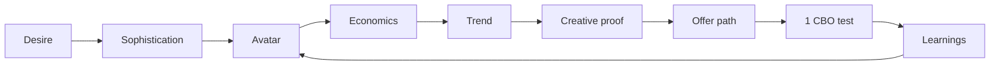

---
tags:
  - origins
  - moc
---

# Origins Brain — Home

Skill program for brands **under $100k/month**. Evolve is later. Money comes from **avatars, ads, offers, learnings** — not media-buying tricks.

## Validate a product (seven gates)

1. [[01 Frameworks/Desire]] — already exists; intensity × scope
2. [[01 Frameworks/Market Sophistication]] — stage 1–5; new mechanism or underserved avatar
3. [[01 Frameworks/Avatars]] — desire-based core + sub-avatar
4. [[01 Frameworks/Unit Economics]] — ~$40–$80; 3× (COGS + ship); margin ~60%+
5. [[04 Research/Google Trends SOP]] — durable, not a one-week spike
6. [[01 Frameworks/Creative Proof]] — others spend; you can still differentiate
7. [[01 Frameworks/Offers]] — bundle/AOV path; result + speed + risk reversal

Score it on [[02 Checklists/Product Scorecard]]. Duplicate [[06 Templates/Template - Product Candidate]].

## Classroom map

| Section | Framework | Lessons |
| --- | --- | --- |
| Start Here | [[The Loop]] | [[01-start-here MOC]] |
| Mindset | [[Mindset and Feedback Loops]] | [[02-origins-mindset MOC]] |
| Tools | [[Tools Stack]] | [[03-tools-suppliers MOC]] |
| Find products | [[Desire]], [[Market Sophistication]] | [[04-how-to-find-products MOC]] |
| Offers | [[Offers]] | [[05-how-to-create-offers MOC]] |
| Prepare for ads | [[Avatars]] | [[06-how-to-prepare-for-ads MOC]] |
| Overwhelmed | [[The Loop]] | [[07-watch-this-if-overwhelmed MOC]] |
| Create ads | [[3-2-2 Concepts]] | [[08-how-to-create-ads MOC]] |
| FB assets | [[Meta Assets]] | [[09-how-to-set-up-fb-assets MOC]] |
| Run ads | [[CBO Testing]] | [[10-how-to-run-ads MOC]] |
| Learnings | [[Learnings Loop]] | [[11-how-to-do-learnings MOC]] |
| Brand back-end | [[Back End Brand]] | [[12-back-end-brand-building MOC]] |
| Operations | [[P and L]] | [[13-operations MOC]] |
| Masterclass | [[0 to 100k Checkpoints]] | [[14-masterclass-0-to-100k MOC]] |

## Working files

- [[03 Working/Inbox]]
- [[03 Working/Product Candidates]]
- [[03 Working/Kill List]]
- [[03 Working/Brand Names]]
- [[04 Research/Watched Queries]]
